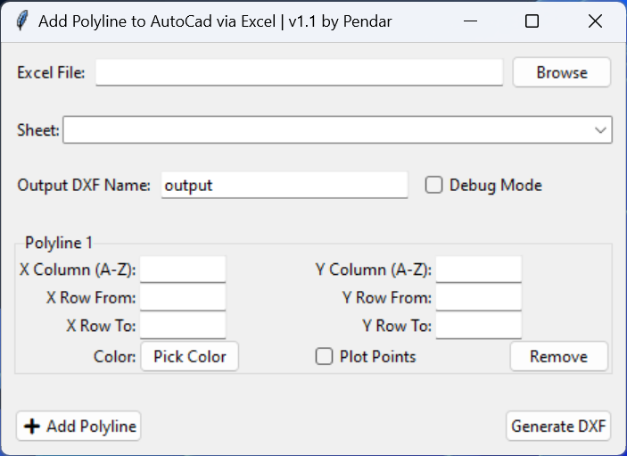

# AutoCad Polyline and Point Plotter via Excel Data

This app draws polylines and points in AutoCad Software with Excel Table Data

Writen in python for Pendar Ind Co.


## Installation

```bash
  git clone https://github.com/qaheri/cad-dot
  cd cad-dot
  pip3 install -r req.txt
  python3 main.py
```

## Images

